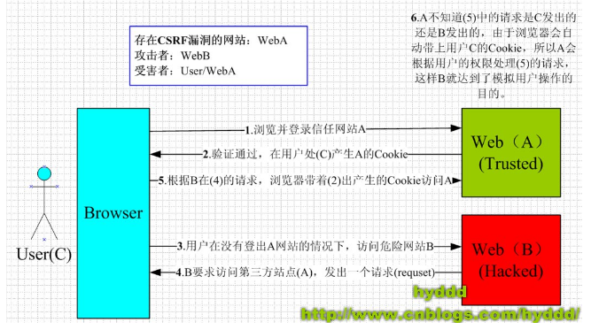

# 过滤器
## 过滤器与拦截器
https://blog.csdn.net/xiaoyaotan_111/article/details/53817918

## spring过滤器
https://blog.csdn.net/MissEel/article/details/79351231

## CSRF
> CSRF全名是Cross-site request forgery，是一种对网站的恶意利用，CSRF比XSS更具危险性。想要深入理解CSRF的攻击特性我们有必要了解一下网站session的工作原理。

>CSRF攻击的主要目的是让用户在不知情的情况下攻击自己已登录的一个系统，类似于钓鱼。如用户当前已经登录了邮箱，或bbs，同时用户又在使用另外一个，已经被你控制的站点，我们姑且叫它钓鱼网站。这个网站上面可能因为某个图片吸引你，你去点击一下，此时可能就会触发一个js的点击事件，构造一个bbs发帖的请求，去往你的bbs发帖，由于当前你的浏览器状态已经是登陆状态，所以session登陆cookie信息都会跟正常的请求一样，纯天然的利用当前的登陆状态，让用户在不知情的情况下，帮你发帖或干其他事情。

原理
https://www.zifangsky.cn/358.html

大神网址：http://www.cnblogs.com/hyddd

			Collection<Long> companyIds = dataPrivilegeHandler .getTruckCompanyCache();
