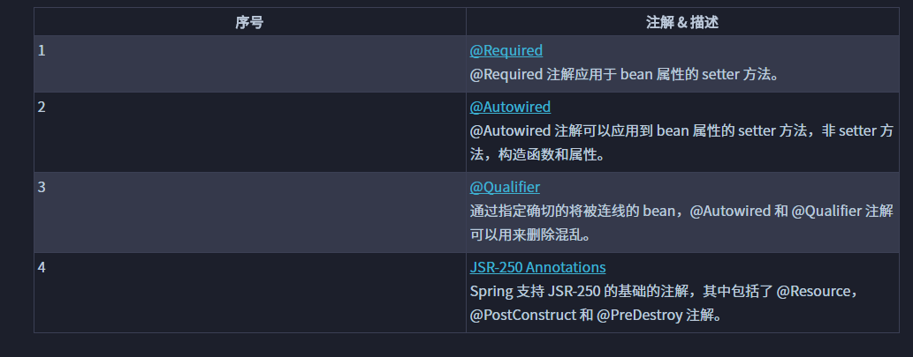
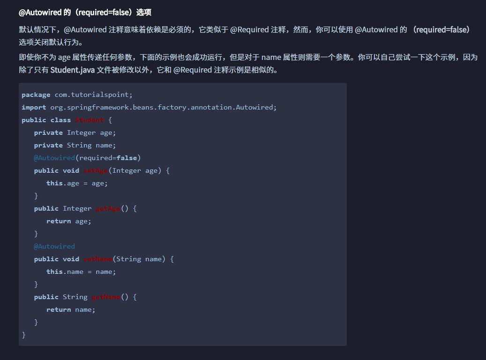
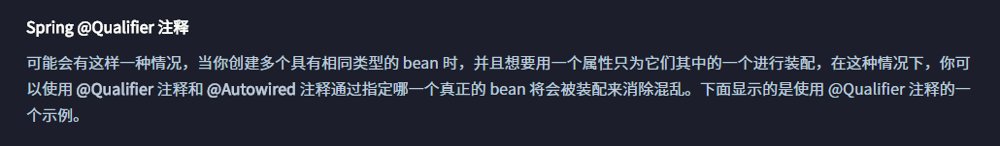
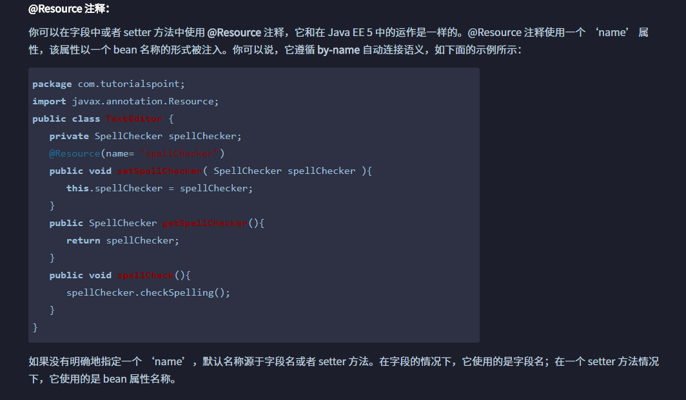

# 注解
## 使用注解的xml文档
```xml
<?xml version="1.0" encoding="UTF-8"?>

<beans xmlns="http://www.springframework.org/schema/beans"
    xmlns:xsi="http://www.w3.org/2001/XMLSchema-instance"
    xmlns:context="http://www.springframework.org/schema/context"
    xsi:schemaLocation="http://www.springframework.org/schema/beans
    http://www.springframework.org/schema/beans/spring-beans-3.0.xsd
    http://www.springframework.org/schema/context
    http://www.springframework.org/schema/context/spring-context-3.0.xsd">

   <context:annotation-config/>
   <!-- bean definitions go here -->

</beans>
```
## 常用的注解
 
### Autowired注解
#### 可以使用required=false选项  

### Qualifier

```xml
<?xml version="1.0" encoding="UTF-8"?>

<beans xmlns="http://www.springframework.org/schema/beans"
    xmlns:xsi="http://www.w3.org/2001/XMLSchema-instance"
    xmlns:context="http://www.springframework.org/schema/context"
    xsi:schemaLocation="http://www.springframework.org/schema/beans
    http://www.springframework.org/schema/beans/spring-beans-3.0.xsd
    http://www.springframework.org/schema/context
    http://www.springframework.org/schema/context/spring-context-3.0.xsd">

   <context:annotation-config/>

   <!-- Definition for profile bean -->
   <bean id="profile" class="com.tutorialspoint.Profile">
   </bean>

   <!-- Definition for student1 bean -->
   <bean id="student1" class="com.tutorialspoint.Student">
      <property name="name"  value="Zara" />
      <property name="age"  value="11"/>
   </bean>

   <!-- Definition for student2 bean -->
   <bean id="student2" class="com.tutorialspoint.Student">
      <property name="name"  value="Nuha" />
      <property name="age"  value="2"/>
   </bean>

</beans>
```
> 使用Qualifier设置使用xml中为student1的bean
```java
package com.tutorialspoint;
import org.springframework.beans.factory.annotation.Autowired;
import org.springframework.beans.factory.annotation.Qualifier;
public class Profile {
   @Autowired
   @Qualifier("student1")
   private Student student;
   public Profile(){
      System.out.println("Inside Profile constructor." );
   }
   public void printAge() {
      System.out.println("Age : " + student.getAge() );
   }
   public void printName() {
      System.out.println("Name : " + student.getName() );
   }
}
```
### @Resource



### @Bean @Construction @Import @Scope
https://www.w3cschool.cn/wkspring/tlbk1icp.html

详见图片assets文件夹20181009135252569.png
